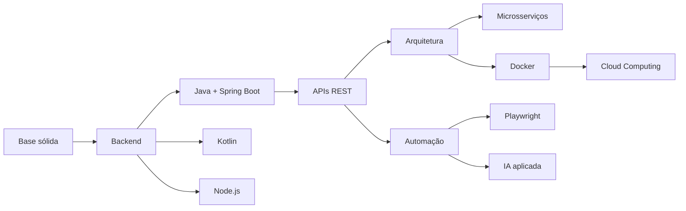

<div align="center">


<br><br>


</div>

---

<table>
<tr>
<td width="55%">

## 🧬 Sobre mim

```java
public class MuriloSantiago {

    private final String role = "Backend Developer em formação";
    private final String location = "São Paulo, Brasil";
    private final String university = "Engenharia de Software";

    private final String[] mainFocus = {
        "Java",
        "Spring Boot",
        "APIs REST",
        "Kotlin",
        "Node.js",
        "Docker",
        "Automação",
        "Inteligência Artificial"
    };

    private final boolean alwaysLearning = true;

    public String mission() {
        return "Construir soluções reais, evoluir constantemente "
             + "e transformar código em impacto.";
    }
}
```

</td>
<td width="45%">

## ⚡ Atualmente focado em

```yaml
Backend:
  - Java
  - Spring Boot
  - APIs REST
  - Kotlin
  - Node.js

Automation:
  - Playwright
  - Scripts
  - IA aplicada ao desenvolvimento

DevOps:
  - Docker
  - Linux
  - Cloud Computing

Base:
  - Algoritmos
  - Estrutura de Dados
  - Arquitetura de Software
```

</td>
</tr>
</table>

---

<div align="center">

# 🚀 Tech Arsenal

<table>
<tr>
<td align="center" width="160">
<h3>Backend</h3>


</td>

<td align="center" width="160">
<h3>Frontend</h3>


</td>

<td align="center" width="160">
<h3>Database</h3>

</td>

<td align="center" width="160">
<h3>Tools</h3>


</td>

<td align="center" width="160">
<h3>Explorando</h3>


</td>
</tr>
</table>

</div>

---

# 🧠 Developer Roadmap



---

# 🏗️ O que estou construindo

<div align="center">

<table>
<tr>
<td width="33%" align="center">

## ⚙️ Backend

APIs REST, regras de negócio, autenticação, integração com banco de dados e estruturação de aplicações modernas.

</td>
<td width="33%" align="center">

## 🤖 Automação & IA

Automação com Playwright, scripts inteligentes e uso de IA para melhorar produtividade e resolver problemas reais.

</td>
<td width="33%" align="center">

## ☁️ Cloud & DevOps

Estudando Docker, Linux e conceitos de cloud computing para entender melhor deploy, ambientes e infraestrutura.

</td>
</tr>
</table>

</div>

---

# 🎯 Objetivos

```txt
01. Evoluir como desenvolvedor backend
02. Criar projetos reais e bem documentados
03. Dominar Java, Spring Boot e APIs REST
04. Explorar Kotlin e Node.js no backend
05. Usar automação e IA para resolver problemas
06. Desenvolver base prática em Docker, Linux e Cloud
```

---

# 📫 Contato

<div align="center">

<a href="mailto:murilod_santiago@hotmail.com">

</a>

<a href="https://www.linkedin.com/in/murilo-santiago">

</a>

</div>

---

<div align="center">

## 🛸 Mindset

```txt
while(alive) {
    learn();
    build();
    improve();
    repeat();
}
```

### “Não é só sobre escrever código. É sobre construir soluções.”


</div>
