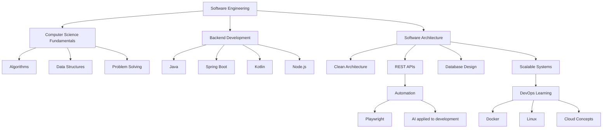

<div align="center">


<br><br>


</div>

---

<table>
<tr>
<td width="58%">

## 🧠 Software Engineering Profile

```java
public class MuriloSantiago {

    private final String degree = "Software Engineering";
    private final String role = "Backend Developer em formação";
    private final String location = "São Paulo, Brasil";

    private final String[] engineeringMindset = {
        "Problem Solving",
        "Clean Code",
        "System Design",
        "Scalable Architecture",
        "Continuous Learning"
    };

    private final String[] coreStack = {
        "Java",
        "Spring Boot",
        "Kotlin",
        "Node.js",
        "Docker",
        "Playwright",
        "MySQL"
    };

    public String mission() {
        return "Projetar, desenvolver e evoluir soluções de software "
             + "com propósito, qualidade e impacto real.";
    }
}
```

</td>
<td width="42%">

## ⚡ Engineering Focus

```yaml
software_engineering:
  - Clean Code
  - System Design
  - Software Architecture
  - Data Structures
  - Algorithms

backend:
  - Java
  - Spring Boot
  - REST APIs
  - Kotlin
  - Node.js

automation_ai:
  - Playwright
  - Intelligent Scripts
  - AI applied to development

devops_learning:
  - Docker
  - Linux
  - Cloud Computing
```

</td>
</tr>
</table>

---

<div align="center">

# ⚙️ Engineering Toolkit

<table>
<tr>

<td align="center" width="180">
<h3>Core Backend</h3>

<br><br>

<br><br>

<br><br>

</td>

<td align="center" width="180">
<h3>Web Base</h3>

<br><br>

<br><br>

<br><br>

</td>

<td align="center" width="180">
<h3>Data</h3>

<br><br>

<br><br>

</td>

<td align="center" width="180">
<h3>DevOps</h3>

<br><br>

<br><br>

</td>

<td align="center" width="180">
<h3>Automation & AI</h3>

<br><br>

<br><br>

</td>

</tr>
</table>

</div>

---

# 🧩 Engineering Roadmap



---

<div align="center">

# 🏗️ Building Mindset

<table>
<tr>

<td width="25%" align="center">

## 🧱 Foundation

Algoritmos, estrutura de dados, lógica, modelagem e boas práticas de engenharia.

</td>

<td width="25%" align="center">

## ⚙️ Backend

APIs REST, autenticação, banco de dados, regras de negócio e aplicações escaláveis.

</td>

<td width="25%" align="center">

## 🤖 Automation

Playwright, scripts, testes automatizados e automações para problemas reais.

</td>

<td width="25%" align="center">

## ☁️ Cloud

Docker, Linux e cloud computing como base para deploy, ambientes e infraestrutura.

</td>

</tr>
</table>

</div>

---

# 🎯 Current Objectives

```txt
[01] Evoluir como desenvolvedor backend
[02] Construir projetos reais, úteis e bem documentados
[03] Aprofundar Java, Spring Boot e APIs REST
[04] Aplicar conceitos de Engenharia de Software em projetos práticos
[05] Explorar Kotlin, Node.js, automação e IA
[06] Desenvolver base prática em Docker, Linux e Cloud
[07] Melhorar arquitetura, organização e qualidade de código
```

---

# 📡 Contact

<div align="center">

<a href="mailto:murilod_santiago@hotmail.com">

</a>

<a href="https://www.linkedin.com/in/murilo-santiago">

</a>

</div>

---

<div align="center">

# ⚡ Engineering Mindset

```java
while (learning) {
    understandProblem();
    designSolution();
    writeCleanCode();
    test();
    improve();
    ship();
}
```

### “Software Engineering is not only about coding. It is about designing solutions that last.”


</div>
