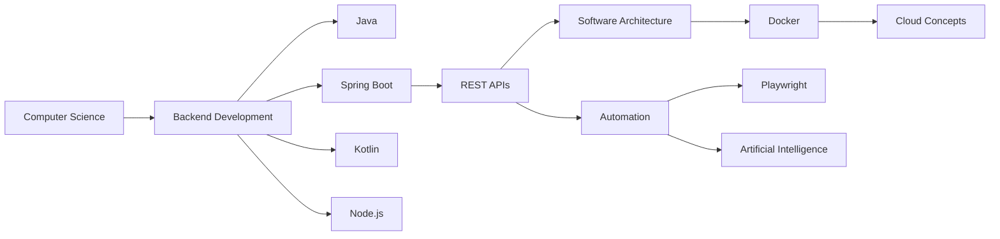

<div align="center">


<br><br>


</div>

---

<table>
<tr>
<td width="55%">

## 🧬 Sobre mim

```java
public class MuriloSantiago {

    private final String role = "Backend Developer em formação";

    private final String[] stack = {
        "Java",
        "Spring Boot",
        "Kotlin",
        "Node.js",
        "Docker",
        "Playwright"
    };

    private final String[] interests = {
        "Backend Development",
        "Automation",
        "Artificial Intelligence",
        "Software Architecture",
        "REST APIs"
    };

    public String currentFocus() {
        return "Construindo aplicações modernas "
             + "e evoluindo constantemente.";
    }
}
```

</td>
<td width="45%">

## ⚡ Atualmente focado em

```yaml
backend:
  - Java
  - Spring Boot
  - APIs REST
  - Kotlin
  - Node.js

automation:
  - Playwright
  - Scripts
  - IA aplicada ao desenvolvimento

devops:
  - Docker
  - Linux
  - Cloud Computing

computer_science:
  - Algoritmos
  - Estrutura de Dados
  - Arquitetura de Software
```

</td>
</tr>
</table>

---

<div align="center">

# 🚀 Tech Arsenal

<table>
<tr>

<td align="center" width="160">

### Backend


<br><br>


<br><br>


<br><br>


<br><br>


</td>

<td align="center" width="160">

### Frontend


<br><br>


<br><br>


</td>

<td align="center" width="160">

### Database


</td>

<td align="center" width="160">

### DevOps


<br><br>


<br><br>


</td>

<td align="center" width="160">

### Automation & AI


<br><br>


</td>

</tr>
</table>

</div>

---

# 🧠 Developer Roadmap



---

# 🏗️ O que estou construindo

<div align="center">

<table>
<tr>

<td width="33%" align="center">

## ⚙️ Backend

APIs REST, autenticação, regras de negócio e aplicações modernas com Java e Spring Boot.

</td>

<td width="33%" align="center">

## 🤖 Automação & IA

Automação com Playwright, scripts inteligentes e exploração de IA aplicada ao desenvolvimento.

</td>

<td width="33%" align="center">

## ☁️ DevOps & Cloud

Aprendendo Docker, Linux e conceitos de cloud computing para melhorar deploy e infraestrutura.

</td>

</tr>
</table>

</div>

---

# 🎯 Objetivos

```txt
01. Evoluir como desenvolvedor backend
02. Construir aplicações escaláveis
03. Dominar Java e Spring Boot
04. Aprender arquiteturas modernas
05. Explorar IA e automação
06. Melhorar conhecimentos em DevOps e Cloud
```

---

# 📫 Contato

<div align="center">

<a href="mailto:murilod_santiago@hotmail.com">

</a>

<a href="https://www.linkedin.com/in/murilo-santiago">

</a>

</div>

---

<div align="center">

# 🛸 Mindset

```java
while(alive) {
    learn();
    build();
    improve();
    repeat();
}
```

### “Não é só sobre escrever código. É sobre construir soluções.”


</div>
