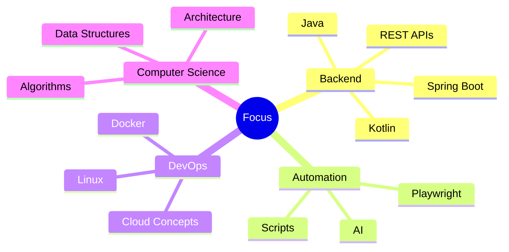

<div align="center">


<br>


<br><br>


</div>

---

# ⚡ About Me

```java
public class MuriloSantiago {

    String role = "Backend Developer";
    
    String[] mainStack = {
        "Java",
        "Spring Boot",
        "Kotlin",
        "Node.js"
    };

    String[] interests = {
        "REST APIs",
        "Automation",
        "Software Architecture",
        "Artificial Intelligence",
        "Backend Systems"
    };

    boolean alwaysLearning = true;

    String currentGoal = 
        "Building scalable and modern applications";
}
```

---

# 🚀 Tech Arsenal

<div align="center">

<table>
<tr>
<td align="center" width="140">

### Backend


<br><br>

<br><br>

<br><br>


</td>

<td align="center" width="140">

### Frontend


<br><br>

<br><br>


</td>

<td align="center" width="140">

### Database


</td>

<td align="center" width="140">

### DevOps


<br><br>

<br><br>


</td>

<td align="center" width="140">

### Automation & AI


<br><br>


</td>
</tr>
</table>

</div>

---

# 🧠 Current Focus

<div align="center">



</div>

---

# 🔥 What I'm Working On

```yaml
backend:
  - REST APIs
  - Authentication Systems
  - Scalable Applications
  - Clean Architecture

automation:
  - Browser Automation
  - AI Integrations
  - Workflow Optimization

learning:
  - Software Architecture
  - Cloud Computing
  - Advanced Backend Concepts
```

---

# 🌐 Connect With Me

<div align="center">

<a href="mailto:murilod_santiago@hotmail.com">

</a>

<a href="https://www.linkedin.com/in/murilo-santiago">

</a>

</div>

---

<div align="center">

## ⚔️ Philosophy

> *"Great software is built through curiosity, consistency and continuous evolution."*

<br>


</div>
