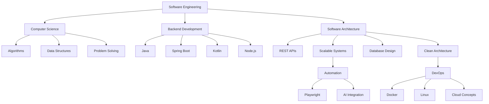

<div align="center">

# ⚡ MURILO SANTIAGO

### Software Engineering Student • Backend Developer • Automation & AI


<br><br>


</div>

---

# 🧠 ABOUT ME

```java
public class MuriloSantiago {

    String role = "Backend Developer";
    
    String university = 
        "Software Engineering Student";

    String[] stack = {
        "Java",
        "Spring Boot",
        "Kotlin",
        "Node.js",
        "Docker",
        "MySQL",
        "Playwright"
    };

    String[] interests = {
        "Software Architecture",
        "REST APIs",
        "Automation",
        "Artificial Intelligence",
        "Scalable Systems"
    };

    boolean learningEveryday = true;

    String currentMission =
        "Building modern applications and "
      + "evolving as a software engineer.";
}
```

---

# ⚙️ TECH ECOSYSTEM

<div align="center">

<table>

<tr>
<td align="center" width="200">

## Backend


<br><br>

<br><br>

<br><br>


</td>

<td align="center" width="200">

## Frontend


<br><br>

<br><br>


</td>

<td align="center" width="200">

## Database


<br><br>


</td>

<td align="center" width="200">

## DevOps


<br><br>

<br><br>


</td>

<td align="center" width="200">

## Automation & AI


<br><br>

<br><br>


</td>
</tr>

</table>

</div>

---

# 🧩 SOFTWARE ENGINEERING ROADMAP



---

# 🚀 CURRENT ENGINEERING FOCUS

<div align="center">

<table>
<tr>

<td width="25%" align="center">

## 🧱 Foundations

Algorithms  
Data Structures  
Clean Code  
Logic  
Problem Solving  

</td>

<td width="25%" align="center">

## ⚙️ Backend

Java  
Spring Boot  
REST APIs  
Authentication  
Scalable Applications  

</td>

<td width="25%" align="center">

## 🤖 Automation

Playwright  
Scripts  
AI Tools  
Workflow Optimization  

</td>

<td width="25%" align="center">

## ☁️ DevOps

Docker  
Linux  
Cloud Concepts  
Infrastructure Basics  

</td>

</tr>
</table>

</div>

---

# 📌 CURRENT OBJECTIVES

```txt
[01] Become a strong backend engineer
[02] Build scalable and modern applications
[03] Improve software architecture skills
[04] Deep dive into Java and Spring ecosystem
[05] Explore automation and AI integration
[06] Learn more about DevOps and Cloud Computing
[07] Build impactful real-world projects
```

---

# 📡 CONTACT

<div align="center">

<a href="mailto:murilod_santiago@hotmail.com">

</a>

<a href="https://www.linkedin.com/in/murilo-santiago">

</a>

</div>

---

<div align="center">

# ⚡ ENGINEERING MINDSET

```java
while(alive) {

    learn();
    
    build();

    fail();

    improve();

    repeat();
}
```

### “Software Engineering is about creating solutions that scale, evolve and make impact.”

<br>


</div>
